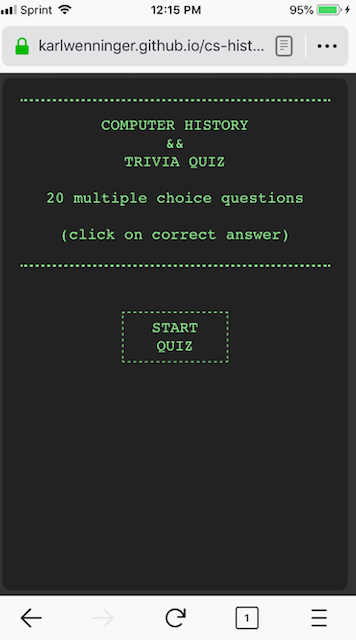

[Play the game!](https://karlwenninger.github.io/cs-history-trivia-quiz/)	

 

## Computer History && Trivia Quiz

A multiple-choice quiz covering computer science, history and trivia topics that I found interesting or amusing. I enjoyed researching and writing the questions just as much as the coding! Once you've answered all the questions there are links to a few wonderful resources that I used.

## Built With

* JavaScript
* CSS
* HTML

## Authors

* **Karl Wenninger** - *Initial work* - [karlWenninger](https://github.com/karlWenninger)

## License

This project is licensed under the MIT License - see the [LICENSE.md](LICENSE.md) file for details
